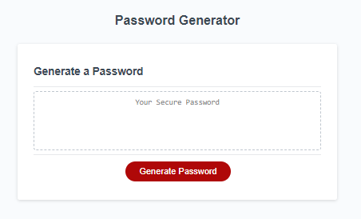
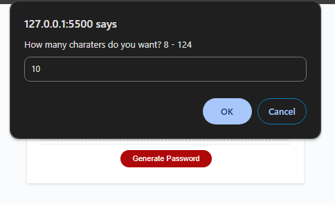
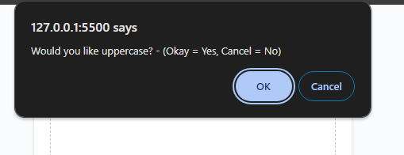
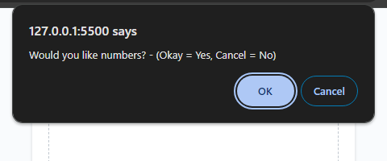
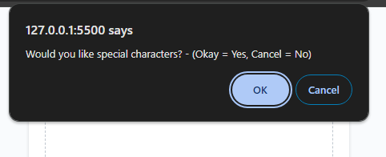
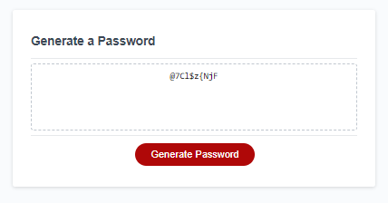

# Password-Generator-Dominic
Password generator challenge
In this task you will see that i have created a password generator. 
The password generator is made up of 3 files, index.html, style.css and script.js.
The script.js file is where the majority of the generator mechanics is created. 
In the script.js file it is coded in a sequencial order and that order is as follow:
    - list of arrays to hold different charater types.
    - function for password options.
    - function for the generator to get a random array.
    - function to generate a random password.
    - reference for the #generate element.
    - writing password into the #password input.
    - adding an event listener to the generate button. 

    Please see screen shots of live application below. 

    

    

    

    

    

    

    

